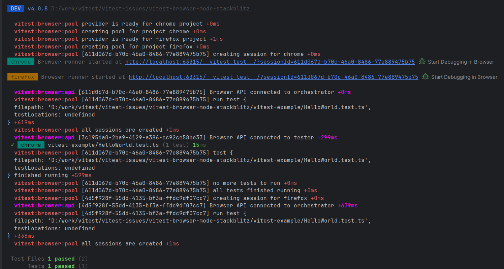

# Vitest 4 Browser Preview Provider

Testing https://github.com/vitest-dev/vitest/pull/8977 PR.

## Spin browser instances (only on local, on StackBlitz not supported)

This repo includes a copy of Vite's `openBrowser` to allow spin the proper browser when running tests with multiple browser instances using the preview provider (only on local, on StackBlitz will use the Vitest Preview Provider, check [Vitest config file](./vitest.browser.config.mts)).

I need to figure out what's the problem running `npm run test:browser` on local, Firefox trying to run Chrome project: memory heap error at Firefox (it hangs, on page refresh shows the `chrome` project).

We need to store browser and session id pairs to show proper url in the terminal when launching the browser instances: https://github.com/vitest-dev/vitest/pull/8977 PR getting the first session id to log the url in the terminal.

We also need to prevent launching multiple browsers when running on StackBlitz at Vitest.

_Vitest debug output running multiple instances_

